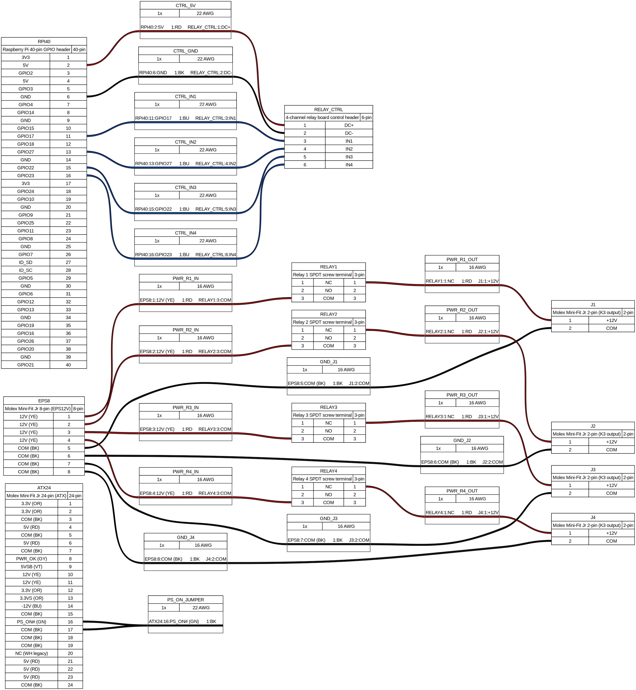

# k3-utils

Utilities for operating a small K3 power cluster from a Raspberry Pi. The
project contains the relay controller, its web UI, and a Jadeite/Kairos image
configuration for deploying them as containers on a Pi 4.

## Wiring harness

The WireViz harness connects four switched EPS12V +12V outputs to four K3
outputs. The relay control inputs connect to Raspberry Pi BCM GPIO17, GPIO27,
GPIO22, and GPIO23 on physical pins 11, 13, 15, and 16.



The vector version is available at [`harness/k3-harness.svg`](harness/k3-harness.svg).
The source definition is [`harness/k3-harness.yml`](harness/k3-harness.yml).

The harness CI regenerates the PNG and SVG on pushes to `main`, and uploads them
as workflow artifacts for pull requests. Release builds attach the same two
files to the GitHub release. To render them locally:

```sh
cd harness
wireviz k3-harness.yml -f ps
```

The relay inputs are active-low. Do not connect relay coils directly to Pi GPIO
pins; use a properly powered relay module/driver, common ground, and suitable
electrical isolation for the switched load.

## Project components

- `relay-gpio/` — C++17 libgpiod service exposing the relay HTTP API. It owns the
  GPIO device and does not serve the browser UI.
- `webui/` — separate nginx web UI container. It proxies API requests to
  `relay-gpio` and supports fixture mode at `/?fixtures` or `/fixtures`.
- `node-config/` — Jadeite/Kairos Quadlet configuration and Pi 4 raw-image
  builder. The generated image starts the relay and web UI containers on boot.
- `compose.yaml` — development/standard-host deployment with the relay API
  private to the Compose network.
- `DEPLOYMENT.md` — Raspberry Pi and Jadeite deployment instructions.

The release workflow builds architecture-specific relay and web UI images,
publishes multi-architecture release tags, and generates a compressed Pi 4 raw
image with its matching release-tagged containers.
